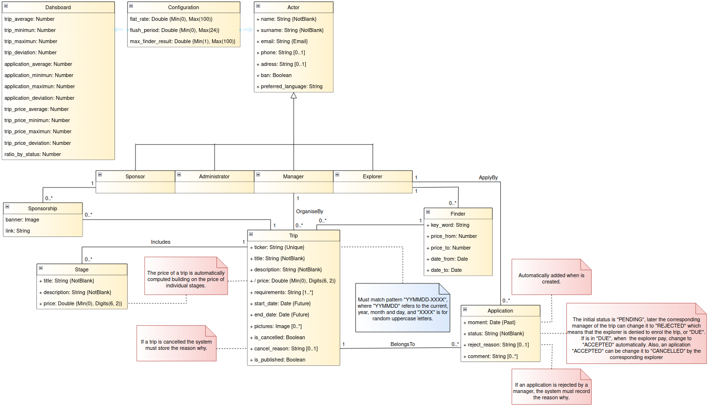

# Acme Explorer project

# Getting started

## MIS-GEMAD API in SwaggerHub
https://app.swaggerhub.com/apis/MIS-GEMAD/MIS-GEMAD_API/1.0.0#/

## Build the image
```
docker-compose build 
```

## Option 1: Run the containers
```
docker-compose up
```

## Option 2: Run the containers (in the background)
```
docker-compose up -d
```

## Down the containers
```
docker-compose down
```

## Manage database from MongoDB Compass
```
mongodb://localhost:27017/ACME_Explorer
```

## Re-populate Mongo Database
```
docker-compose down
docker-compose up -d
```

## Masive charge

### Step 1: Download files

Go to this GoogleDrive [link](https://drive.google.com/drive/folders/1o6bA-HNdBZBbilZ-AkcnC01BHaisW_80?usp=sharing) and download the files do you want to charge. There are files with 1K, 10K, 100K and 1000K objetcs to prove the masive charge.

### Step 2: Create a init_data folder in root directory of the project
```
mkdir init_data
```

### Step 3: Build the image as it's specified before

### Step 4: Import the Postman collection that is in postmanCollection folder

### Step 5: Run the Postman calls that are in MASIVECHARGE folder


## Run test
docker exec -it test npm run test

# Conceptual Model


